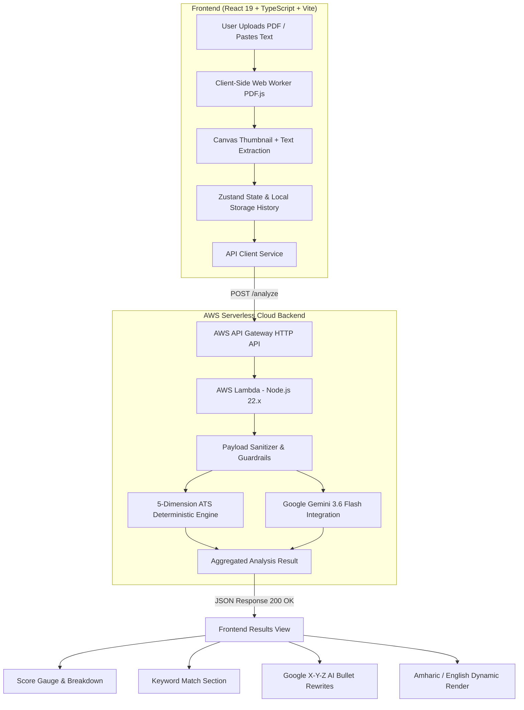

# ResuMatch AI 🎯

<div align="center">


[](https://react.dev/)
[](https://www.typescriptlang.org/)
[](https://vitejs.dev/)
[](https://tailwindcss.com/)
[](https://aws.amazon.com/serverless/)
[](https://ai.google.dev/)
[](https://vitest.dev/)
[](https://opensource.org/licenses/MIT)

<p align="center">
  <b>AI-Powered Resume Analysis & AWS Serverless ATS Compatibility Engine</b><br>
  Analyze resumes against real-world job descriptions, calculate deterministic 0–100 ATS compatibility scores across 5 key dimensions, identify missing keywords, and generate tailored Google X-Y-Z formula AI bullet point rewrites using Google Gemini 3.6 Flash on AWS Serverless.
</p>

<p align="center">
  <b>🌍 Bilingual Support: English & Amharic (አማርኛ)</b>
</p>

</div>

---

### 📖 ማብራሪያ (Amharic Overview)
> **ResuMatch AI** በሰው ሰራሽ አስተውሎት (AI) እና በ AWS Serverless ቴክኖሎጂ የተደገፈ ዘመናዊ የስራ ማመልከቻ (Resume) መገምገሚያ ነው። 
> የርስዎን Resume ከተፈለገው የስራ መስፈርት (Job Description) ጋር በማነፃፀር በ 5 ቁልፍ መስፈርቶች ከ 0 እስከ 100 ነጥብ ይሰጣል፤ የቀሩትን ቃላት (Keywords) ይለያል፤ እንዲሁም ተቀባይነትዎን ከፍ የሚያደርጉ የ Google X-Y-Z ፎርሙላ ማሻሻያዎችን በ Gemini AI ያመነጫል።

---

## 📑 Table of Contents
- [📸 Overview & Highlights](#-overview--highlights)
- [🏛️ System Architecture](#️-system-architecture)
- [✨ Key Features](#-key-features)
- [🎯 5-Dimension ATS Scoring Engine](#-5-dimension-ats-scoring-engine)
- [🛠️ Tech Stack](#️-tech-stack)
- [📁 Project Structure](#-project-structure)
- [🧪 Testing & Quality Assurance](#-testing--quality-assurance)
- [🚀 Quickstart & Setup Guide](#-quickstart--setup-guide)
  - [1. Prerequisites](#1-prerequisites)
  - [2. Installation](#2-installation)
  - [3. Environment Configuration](#3-environment-configuration)
  - [4. Running Development Servers](#4-running-development-servers)
- [☁️ AWS Deployment (SAM CLI)](#️-aws-deployment-sam-cli)
- [🔒 Security & Privacy Policy](#-security--privacy-policy)
- [🔮 Project Roadmap](#-project-roadmap)
- [📄 License](#-license)

---

## 📸 Overview & Highlights

ResuMatch AI is an enterprise-grade, privacy-first SaaS platform designed to replicate modern Applicant Tracking System (ATS) parsing algorithms (such as Greenhouse, Lever, Workday, and Taleo). 

- **100% Client-Side Privacy**: PDF parsing occurs in the browser using Web Workers. Unencrypted files are never saved on third-party servers.
- **Deterministic & Repeatable Scoring**: Mathematical 0–100 scoring based on keyword frequency, technical term matching, formatting safety, and Google X-Y-Z metrics.
- **Generative AI Coaching**: Google Gemini 3.6 Flash delivers tailored bullet point rewrites, missing skill recommendations, and section-by-section action items.
- **AWS Serverless Microservice**: Production-ready AWS Lambda (`nodejs22.x`) deployed with AWS SAM Infrastructure-as-Code.
- **Full Internationalization (i18n)**: Instant switching between English and Amharic (አማርኛ).

---

## 🏛️ System Architecture



---

## ✨ Key Features

### 1. 📄 Privacy-First Client-Side PDF Parsing
- **Zero-Cloud File Uploads**: Fast text extraction using `pdfjs-dist` in background Web Workers.
- **Real-Time Canvas Previews**: Renders high-resolution first-page thumbnails.
- **Text Length & Token Metrics**: Real-time word count, character count, and plain text inspector.

### 2. 🎯 Deterministic 5-Dimension ATS Scoring
- Emulates commercial ATS parsing algorithms with mathematical precision.
- Safe regex term matching supporting complex technical tokens (`C++`, `.NET`, `Node.js`, `CI/CD`).
- Instant 0–100 weighted scoring with score tiering (`Exceptional`, `Strong`, `Moderate`, `Needs Improvement`).

### 3. 🤖 AI Recommendations via Google Gemini 3.6 Flash
- **Executive Summary**: High-level recruiter impression.
- **Strengths & Critical Weaknesses**: Concrete gap analysis against the target job posting.
- **Google X-Y-Z Formula Bullet Rewrites**: Transform passive bullet points (*"Responsible for building APIs"*) into high-impact accomplishments (*"Engineered 12 RESTful microservices with Node.js and AWS Lambda, improving API response times by 42%"*).
- **Missing Technical Keywords**: Tagged by importance with contextual integration advice.

### 4. 🌍 Full Internationalization (i18n)
- Seamless dual-language support for **English** and **Amharic (አማርኛ)**.
- Localized headings, buttons, score labels, accordion recommendations, and metrics.
- Language selection persisted in `localStorage`.

### 5. ⚡ Frictionless Guest Experience & History
- Unrestricted access across all routes (`/`, `/analyzer`, `/dashboard`, `/results`).
- Automatic scan history saved to `localStorage` with automatic corruption recovery.
- **One-Click Example Loader**: Instantly test real ATS scoring with pre-loaded candidate resumes and Stripe job requirements.

---

## 🎯 5-Dimension ATS Scoring Engine

| Dimension | Weight | What It Measures |
| :--- | :---: | :--- |
| **1. Hard Skills & Keyword Density** | **35%** | Matches exact and related technical skills from the job description with normalized regex tokenization. |
| **2. Role & Experience Alignment** | **25%** | Evaluates job title alignment, domain overlap, and semantic seniority depth. |
| **3. Measurable Impact (Google X-Y-Z)** | **20%** | Detects quantifiable metrics (percentages, dollar amounts, scale counts) and accomplishment verbs. |
| **4. ATS Formatting & Structure** | **10%** | Checks standard section headers (Experience, Education, Skills), layout safety, and character hygiene. |
| **5. Action Tone & Seniority Voice** | **10%** | Analyzes strong power verbs vs passive voice and repetitive phrasing. |

---

## 🛠️ Tech Stack

### Frontend
- **Framework**: [React 19](https://react.dev/) + [TypeScript](https://www.typescriptlang.org/)
- **Build Tool**: [Vite 8](https://vitejs.dev/)
- **Styling**: [Tailwind CSS v4](https://tailwindcss.com/) + Custom Glassmorphism & Micro-animations
- **PDF Engine**: [pdfjs-dist](https://mozilla.github.io/pdf.js/) (Web Worker text extraction + HTML5 Canvas rendering)
- **State Management**: [Zustand v5](https://github.com/pmndrs/zustand) with `localStorage` persistence
- **Icons**: [Lucide React](https://lucide.dev/)

### Backend & Cloud Infrastructure
- **Compute**: [AWS Lambda](https://aws.amazon.com/lambda/) (`nodejs22.x`, 512MB RAM, ESM)
- **API Management**: [AWS API Gateway HTTP API](https://aws.amazon.com/api-gateway/) with CORS configuration
- **Infrastructure as Code**: [AWS SAM CLI](https://aws.amazon.com/serverless/sam/) + [esbuild](https://esbuild.github.io/)
- **AI Model**: [Google Gemini 3.6 Flash](https://ai.google.dev/) via `@google/genai`
- **Local Dev Server**: Standalone Node.js HTTP server (`backend/local-server.js`) for Docker-free development

### Testing & Tooling
- **Test Runner**: [Vitest](https://vitest.dev/)
- **Linter & Type Checker**: TypeScript Compiler (`tsc`) + ESLint

---

## 📁 Project Structure

```text
ResuMatch/
├── backend/                        # AWS Serverless Lambda Microservice
│   ├── env.json                    # Local SAM environment variables (Git-ignored)
│   ├── local-server.js             # Lightweight local Node.js HTTP dev server (Port 3001)
│   ├── package.json                # Backend dependencies (@google/genai, esbuild)
│   ├── samconfig.toml              # AWS SAM deployment parameters
│   ├── template.yaml               # AWS SAM Infrastructure template (Lambda + HTTP API)
│   ├── src/
│   │   ├── analysis/               # Relocated ATS engine & deterministic parsers
│   │   │   ├── keywordExtractor.ts # Hard skill & keyword extraction
│   │   │   ├── parsers/            # Impact, formatting & section parsers
│   │   │   └── scoring/            # 5-dimension weighted scoring math
│   │   ├── handlers/               # AWS Lambda API Gateway event handlers
│   │   │   └── analyze.ts          # Main /analyze endpoint handler
│   │   ├── services/               # Server-side Gemini AI integration
│   │   │   └── gemini.ts           # Google GenAI SDK wrapper & prompt engineering
│   │   ├── types/                  # Backend TypeScript interfaces
│   │   └── utils/                  # Score tiering & response helpers
│   └── tests/                      # Backend Lambda & ATS unit tests
│       ├── atsScoring.test.ts      # Scoring math and regex safety tests
│       └── lambdaHandler.test.ts   # Lambda event contract & error handling tests
├── public/                         # Static assets & sample resume PDF
├── src/                            # React 19 Frontend Application
│   ├── components/                 # Reusable UI component library
│   │   ├── analyzer/               # Upload dropzone, form & text inputs
│   │   ├── home/                   # Hero, feature grid, preview & cards
│   │   ├── layout/                 # Header, Footer, Language switcher
│   │   └── results/                # Score gauge, breakdown & AI accordions
│   ├── data/                       # Sample scan presets (Fullstack, Stripe, etc.)
│   ├── hooks/                      # Custom hooks (usePdfParser)
│   ├── i18n/                       # Dual-language translations (English & Amharic)
│   │   ├── en.ts                   # English dictionary
│   │   ├── am.ts                   # Amharic (አማርኛ) dictionary
│   │   └── useLanguageStore.ts     # i18n Zustand state store
│   ├── pages/                      # Page routes (Home, Analyzer, Results, Dashboard)
│   ├── services/                   # Frontend API client wrapper (src/services/api.ts)
│   ├── stores/                     # Zustand state stores (analysis, guest history)
│   ├── types/                      # Frontend TypeScript interfaces
│   └── utils/                      # Client PDF canvas rendering & helpers
├── tests/                          # Root integration & frontend test suites
│   ├── apiService.test.ts          # API contract & error fallback tests
│   ├── atsEngine.test.ts           # Client ATS engine unit tests
│   ├── authAndGuest.test.ts        # Guest routing tests
│   ├── geminiService.test.ts       # Gemini service & missing key tests
│   ├── i18nAndLanguage.test.ts     # English & Amharic dictionary tests
│   ├── pdfAndSecurity.test.ts      # Secret isolation & PDF text tests
│   ├── realResumeFix.test.ts       # Control character & regression tests
│   └── storeAndHistory.test.ts     # Zustand history & corruption recovery tests
├── .env.example                    # Sample frontend environment config
├── package.json                    # Root package scripts & dependencies
├── tailwind.config.js              # Tailwind styling configuration
├── tsconfig.json                   # TypeScript configuration
└── vitest.config.ts                # Vitest test runner configuration
```

---

## 🧪 Testing & Quality Assurance

ResuMatch AI includes an automated test suite containing **61 unit, integration, and security tests across 10 test files**:

```bash
npm test
```

| Test Suite | Location | Tests | Focus Area |
| :--- | :--- | :---: | :--- |
| **ATS Scoring Engine** | [`tests/atsEngine.test.ts`](file:///c:/Users/hp/Desktop/Portfolio/ResuMatch/tests/atsEngine.test.ts) | 12 | Score stability, regex escaping (`C++`/`.NET`), empty/large input safety |
| **Backend ATS Math** | [`backend/tests/atsScoring.test.ts`](file:///c:/Users/hp/Desktop/Portfolio/ResuMatch/backend/tests/atsScoring.test.ts) | 13 | 5-dimension deterministic formulas, weighted bounds & keyword density |
| **AWS Lambda Handler** | [`backend/tests/lambdaHandler.test.ts`](file:///c:/Users/hp/Desktop/Portfolio/ResuMatch/backend/tests/lambdaHandler.test.ts) | 6 | `APIGatewayProxyEventV2` payload limits (>50k chars), CORS headers, error trapping |
| **Real Resume Robustness**| [`tests/realResumeFix.test.ts`](file:///c:/Users/hp/Desktop/Portfolio/ResuMatch/tests/realResumeFix.test.ts) | 5 | Control character sanitization, null byte scrubbing & multi-page parsing |
| **Gemini AI Service** | [`tests/geminiService.test.ts`](file:///c:/Users/hp/Desktop/Portfolio/ResuMatch/tests/geminiService.test.ts) | 4 | Structured AI output validation, API error handling & missing key detection |
| **API Service Contract** | [`tests/apiService.test.ts`](file:///c:/Users/hp/Desktop/Portfolio/ResuMatch/tests/apiService.test.ts) | 5 | HTTP status codes (200, 400, 500) and network disconnect recovery |
| **i18n & Translations** | [`tests/i18nAndLanguage.test.ts`](file:///c:/Users/hp/Desktop/Portfolio/ResuMatch/tests/i18nAndLanguage.test.ts) | 4 | Key parity between English and Amharic dictionaries, store toggles |
| **Store & History** | [`tests/storeAndHistory.test.ts`](file:///c:/Users/hp/Desktop/Portfolio/ResuMatch/tests/storeAndHistory.test.ts) | 4 | Zustand state resets, `localStorage` persistence, corrupted JSON recovery |
| **PDF & Security Audit** | [`tests/pdfAndSecurity.test.ts`](file:///c:/Users/hp/Desktop/Portfolio/ResuMatch/tests/pdfAndSecurity.test.ts) | 4 | Bundle inspection, secret leakage prevention, word count normalization |
| **Auth & Guest Access** | [`tests/authAndGuest.test.ts`](file:///c:/Users/hp/Desktop/Portfolio/ResuMatch/tests/authAndGuest.test.ts) | 4 | Frictionless guest browsing across all application routes |

---

## 🚀 Quickstart & Setup Guide

### 1. Prerequisites
- **Node.js**: `v20.0.0` or higher (`v22.14.0` recommended)
- **npm**: `v10.0.0` or higher
- **Google Gemini API Key**: [Get an API Key from Google AI Studio](https://aistudio.google.com/)
- **Docker Desktop & AWS SAM CLI** *(Optional, only required for local SAM container simulation)*

### 2. Installation

```bash
# Clone the repository
git clone https://github.com/NardosShumete/AI-Resume-Match-on-AWS.git
cd AI-Resume-Match-on-AWS

# Install frontend dependencies
npm install

# Install backend dependencies
cd backend && npm install && cd ..
```

### 3. Environment Configuration

#### Frontend (`.env` in project root)
```env
VITE_API_URL=http://127.0.0.1:3001/analyze
```

#### Backend (`backend/.env` or `backend/env.json`)
```env
GEMINI_API_KEY=your_google_gemini_api_key_here
PORT=3001
```

For SAM Local Docker testing, create `backend/env.json`:
```json
{
  "AnalyzeResumeFunction": {
    "GEMINI_API_KEY": "your_google_gemini_api_key_here"
  }
}
```

### 4. Running Development Servers

#### Option A: Lightweight Local Node Server (Recommended - No Docker Required)

Open two terminal tabs:

```bash
# Terminal 1: Start Backend API (Builds & serves on http://127.0.0.1:3001)
npm run backend

# Terminal 2: Start Vite Frontend (Serves on http://localhost:5173)
npm run dev
```

#### Option B: AWS SAM CLI Local Emulation (Docker Required)

```bash
# Build Lambda package with SAM esbuild
sam build -t backend/template.yaml --region us-east-1

# Start Local API Gateway emulator
sam local start-api -t .aws-sam/build/template.yaml -n backend/env.json -p 3001 --region us-east-1 --skip-pull-image

# In another terminal, start the frontend
npm run dev
```

Visit [`http://localhost:5173`](http://localhost:5173) to start analyzing resumes!

---

## ☁️ AWS Deployment (SAM CLI)

To deploy the backend microservice to your live AWS account:

```bash
# 1. Navigate to backend directory
cd backend

# 2. Build the Lambda artifact
sam build

# 3. Guided deployment to AWS
sam deploy --guided
```

During the guided deployment prompt:
- **Stack Name**: `resumatch-backend`
- **AWS Region**: `us-east-1` (or your preferred region)
- **Parameter GeminiApiKey**: `[Your-Production-Gemini-API-Key]`
- **Allow SAM CLI to create IAM roles**: `Y`

Once deployed, copy the **API Gateway HTTP API URL** from the output and update your frontend `VITE_API_URL` environment variable.

---

## 🔒 Security & Privacy Policy

1. **Strict Secret Isolation**: The `GEMINI_API_KEY` is strictly confined to the backend serverless execution environment. It is never bundled or exposed in Vite client builds.
2. **Client-Side Document Parsing**: PDF files are processed directly inside client browser Web Workers. The document is converted to plain text locally before ATS processing.
3. **Payload Sanitization & Limits**:
   - 50,000-character payload length limit to protect backend compute resources.
   - Automatic stripping of dangerous ASCII control characters and null bytes (`\u0000`).
   - Strict JSON validation guarding against malformed payloads.

---

## 🔮 Project Roadmap

- [x] **Phase 1: Modern SaaS Interface & Guest Access**: Dark/light themes, frictionless guest routing, and instant sample loader.
- [x] **Phase 2: Client-Side PDF Parsing**: In-browser PDF text extraction and live first-page canvas thumbnail generation.
- [x] **Phase 3: Deterministic ATS Engine & Gemini AI**: 5-dimension deterministic scoring + Google Gemini 3.6 Flash structured bullet rewrites.
- [x] **Phase 4: AWS Serverless Backend & SAM Local Validation**: AWS Lambda microservice, API Gateway template, local Node runner, and Docker SAM Local E2E verification.
- [x] **Phase 5: Bilingual Support**: Full English and Amharic (አማርኛ) internationalization and UI switching.
- [ ] **Phase 6: Cloud History Persistence**: Amazon DynamoDB integration for persistent user scan history.
- [ ] **Phase 7: Export to Tailored PDF**: One-click export of rewritten resumes and ATS score audit reports.

---

## 📄 License

This project is licensed under the **MIT License** - see the [LICENSE](LICENSE) file for details.

---

<div align="center">
  <sub>Built with ❤️ by Nardos Shumete. Empowering job seekers with transparent ATS intelligence.</sub>
</div>
